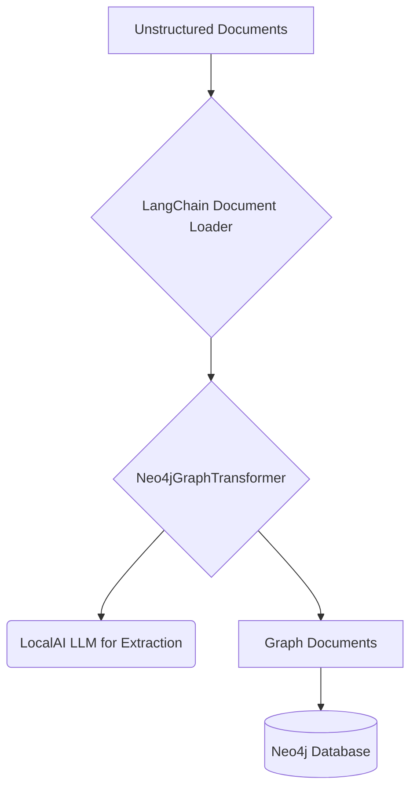
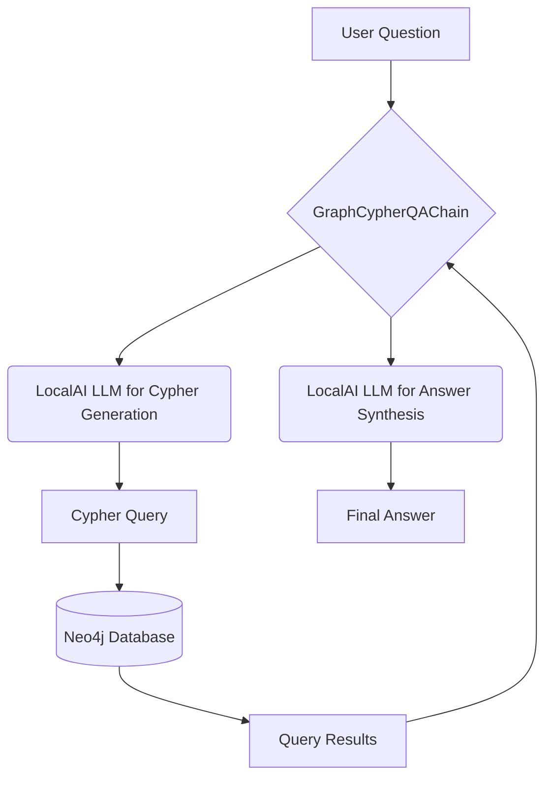

# Building a Local GraphRAG Application with LocalAI, Neo4j, and LangChain

This guide provides a comprehensive walkthrough for building a Retrieval-Augmented Generation (RAG) application using a knowledge graph. This approach, known as GraphRAG, leverages the structured nature of graph databases to provide more contextually aware and accurate responses from Large Language Models (LLMs).

The entire stack runs locally, ensuring your data remains private. We will use:
- **LocalAI** as a local, OpenAI-compatible server to run LLMs and embedding models.
- **Neo4j** as the graph database to store and query the knowledge graph.
- **LangChain** as the framework to connect and orchestrate these components.

While there are no public, end-to-end examples of this specific stack, this guide provides a complete, runnable template that you can adapt and build upon.

## System Design

Before diving into the code, it's important to understand the components and the flow of data through the system.

### Core Components

*   **LocalAI:** This is the "brain" of our operation, providing local, private access to LLMs. It will be used for three key NLP tasks:
    1.  **Entity & Relationship Extraction:** Identifying nodes and edges from raw text to build the graph.
    2.  **Cypher Generation:** Translating a user's natural language question into a Neo4j Cypher query.
    3.  **Answer Synthesis:** Generating a final, human-readable answer from the data retrieved from the graph.

*   **Neo4j:** This is the "memory" of our system. It's a high-performance graph database that stores the nodes and relationships extracted from our documents. Its query language, Cypher, is excellent for traversing and retrieving data from complex networks.

*   **LangChain:** This is the "plumbing" or "orchestrator." It provides the framework that connects our components. We will use specific LangChain modules:
    *   `OpenAI` LLM class to communicate with the LocalAI server.
    *   `Neo4jGraphTransformer` to manage the extraction and structuring of graph data.
    *   `GraphCypherQAChain` to create the end-to-end query-to-answer pipeline.

*   **Application Code (`main.py`):** This is our entrypoint that uses LangChain to execute the data ingestion and querying flows.

### Data Ingestion Flow (ETL)

This is the process of converting unstructured documents into a structured knowledge graph.



### Query Flow (RAG)

This is the process of answering a user's question using the knowledge graph.



## Prerequisites

1.  **Docker:** Required for running LocalAI and Neo4j.
2.  **Python 3.8+:** With `pip` for installing packages.
3.  **LocalAI:** A running instance of LocalAI. You can follow the official [LocalAI documentation](https://localai.io/docs/getting-started/) to get started.
    *   **Model Configuration:** For this guide, we recommend using a model suitable for instruction-following. You can add the following to your `docker-compose.yaml` in the `localai` service environment section:
        ```yaml
        - MODELS_GALLERY=[{"name": "llama-3.1-8b-instruct", "url": "github:ggerganov/llama.cpp/gguf/Meta-Llama-3.1-8B-Instruct-Q4_K_M.gguf"}]
        ```
    *   This will download the Llama 3.1 model from the community gallery.
4.  **Neo4j:** A running Neo4j instance. The easiest way is to use the official Docker image:
    ```bash
    docker run \
        -p 7474:7474 -p 7687:7687 \
        -d \
        --name neo4j \
        -e NEO4J_AUTH=neo4j/password \
        neo4j:latest
    ```
    You can access the Neo4j Browser at `http://localhost:7474`.

## Step-by-Step Guide

### 1. Install Dependencies

First, install the necessary Python libraries:

```bash
pip install langchain langchain-community langchain-experimental neo4j openai python-dotenv
```

### 2. Configure Environment Variables

Create a `.env` file in your project directory with the following content:

```
NEO4J_URI=bolt://localhost:7687
NEO4J_USERNAME=neo4j
NEO4J_PASSWORD=password

# Point this to your LocalAI server endpoint
OPENAI_API_BASE=http://localhost:8080/v1
OPENAI_API_KEY=sk-xxxxxxxxxxxxxxxxxxxxxxxxxxxxxxxxxxxxxxxx
```

### 3. The Code

Here is the complete, runnable Python script. You can save this as `main.py`.

```python
import os
from langchain_community.graphs import Neo4jGraph
from langchain.docstore.document import Document
from langchain_experimental.graph_transformers import Neo4jGraphTransformer
from langchain_community.llms import OpenAI
from langchain.chains import GraphCypherQAChain

# --- 1. Configuration ---
# Load environment variables from .env file if present
try:
    from dotenv import load_dotenv
    load_dotenv()
except ImportError:
    print("dotenv not found, skipping.")

# Note: The OPENAI_API_KEY is not strictly required for LocalAI,
# but the library expects it to be set.
os.environ["OPENAI_API_KEY"] = os.getenv("OPENAI_API_KEY", "required-but-not-used")

# --- 2. Initialize LLM and Graph ---

# Initialize the LLM, pointing to your LocalAI endpoint
# Make sure to specify the model you have loaded in LocalAI
try:
    llm = OpenAI(
        openai_api_base=os.getenv("OPENAI_API_BASE"),
        model_name="llama-3.1-8b-instruct" # Change this to your model
    )
except Exception as e:
    print(f"Error initializing LLM: {e}")
    exit()


# Initialize the Neo4j graph connection
try:
    graph = Neo4jGraph(
        url=os.getenv("NEO4J_URI"),
        username=os.getenv("NEO4J_USERNAME"),
        password=os.getenv("NEO4J_PASSWORD")
    )
    # Clear the graph to ensure a fresh start
    graph.query("MATCH (n) DETACH DELETE n")
except Exception as e:
    print(f"Error connecting to Neo4j: {e}")
    exit()

# --- 3. Data Ingestion and Graph Construction ---

# Sample documents to build the knowledge graph
documents = [
    Document(page_content="Serena is a software engineer at Google. She is an expert in building AI-powered applications."),
    Document(page_content="Google is a technology company that specializes in Internet-related services and products."),
    Document(page_content="LangChain is a framework for developing applications powered by large language models."),
    Document(page_content="Serena uses LangChain to build applications that connect to Neo4j."),
    Document(page_content="Neo4j is a graph database management system.")
]

# Use the GraphTransformer to convert documents into a graph structure
# This will use the LLM to extract entities and relationships
print("Constructing knowledge graph from documents...")
graph_transformer = Neo4jGraphTransformer(llm=llm)
graph_documents = graph_transformer.convert_to_graph_documents(documents)

# Add the graph documents to the Neo4j database
graph.add_graph_documents(graph_documents)

print("Knowledge graph constructed successfully.")
print(f"Nodes: {[node.id for node in graph_documents[0].nodes]}")
print(f"Relationships: {[rel.type for rel in graph_documents[0].relationships]}")


# --- 4. Querying the Knowledge Graph ---

# Create the GraphCypherQAChain
# This chain will convert a question into a Cypher query,
# execute it, and use the LLM to generate an answer.
chain = GraphCypherQAChain.from_llm(
    graph=graph,
    llm=llm,
    verbose=True
)

# Ask a question
print("\n--- Querying the Knowledge Graph ---")
question = "Who is Serena and what does she do?"
result = chain.invoke({"query": question})

print("\n--- Query Result ---")
print(f"Question: {question}")
print(f"Answer: {result['result']}")

question_2 = "What is the relationship between Serena and LangChain?"
result_2 = chain.invoke({"query": question_2})
print(f"\nQuestion: {question_2}")
print(f"Answer: {result_2['result']}")

```

### 5. Running the Application

1.  Make sure your LocalAI and Neo4j instances are running.
2.  Run the Python script:
    ```bash
    python main.py
    ```

### 6. Verifying the Graph in Neo4j

After running the script, you can inspect the graph visually.
1.  Open the Neo4j Browser at `http://localhost:7474`.
2.  Connect to the database using your credentials (`neo4j`/`password`).
3.  Run the following Cypher query to see all nodes and relationships:
    ```cypher
    MATCH (n) RETURN n
    ```
You should see a graph representing the entities and relationships from the sample documents.

## Adapting Ollama Examples

You will find many examples and tutorials that use Ollama instead of LocalAI. You can easily adapt these examples to use LocalAI by making the following changes:

1.  **LLM Initialization:** Instead of using `langchain_community.llms.Ollama`, you will use `langchain_community.llms.OpenAI` as shown in this guide.
2.  **API Endpoint:** Make sure the `OPENAI_API_BASE` environment variable points to your LocalAI server's endpoint (e.g., `http://localhost:8080/v1`).
3.  **Model Name:** When initializing the `OpenAI` class, make sure the `model_name` parameter matches the name of the model you have configured in LocalAI.

## Conclusion

This guide provides a solid foundation for building a fully local and private GraphRAG application. By leveraging the power of LocalAI, the flexibility of LangChain, and the structured nature of Neo4j, you can create sophisticated, context-aware AI applications that operate entirely on your own infrastructure.

From here, you can expand the application by:
-   **Ingesting Your Own Data:** Replace the sample documents with a `DirectoryLoader` or other LangChain loaders to ingest your own files.
-   **Prompt Engineering:** Fine-tune the prompts used for entity and relationship extraction within the `Neo4jGraphTransformer` for better accuracy.
-   **Building a UI:** Integrate this backend logic into a Streamlit or FastAPI application to create a user-friendly interface.
-   **Advanced Agents:** Explore more advanced LangChain agents for more complex interactions with the graph.
